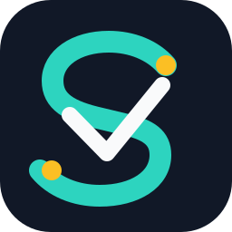

# SpanVouch

[](https://github.com/naturaljam/SpanVouch/actions/workflows/ci.yml)
[](https://www.python.org/)
[](LICENSE)

[](README.md)
[](README.zh-CN.md)



**Open-source infrastructure for evidence-backed agent diagnosis, verification, review, and recovery.**

SpanVouch turns agent execution traces into an auditable engineering workflow: structured evidence,
bounded diagnosis, independent verification, human decisions, and durable recovery. The default path
is deterministic and offline; provider-backed calls are explicit opt-in.

## Why SpanVouch

- Strict TraceIR and versioned schemas replace ad-hoc log parsing.
- Rules-first diagnosis supports optional provider adapters.
- Independent verification supports abstention and one bounded revision.
- SQLite persistence, leases, idempotency, immutable events, and CAS updates support recovery.
- Frozen datasets, manifests, and deterministic reports provide regression control.

## Engineering loop

```text
agent trace -> TraceIR -> diagnosis -> independent verification
             -> bounded revision -> human review -> durable decision
```

The IVAD (Independently Verified Agent Diagnosis) boundary is an engineering protocol: a diagnosis
is not treated as verified until an independent verifier and a human decision complete their steps.

## Build on it

Use SpanVouch as the foundation for agent quality platforms, support-operation review, tool-call
incident analysis, and audit trails. The release includes FastAPI and CLI delivery, SQLite recovery,
Docker/Compose packaging, LangGraph and AutoGen adapters, plus SupportLab and OpsLab evaluation labs.

## Quick start

Requirements: Python 3.12, [uv](https://docs.astral.sh/uv/) 0.8.x, and optionally Docker Compose v2.

```bash
git clone https://github.com/naturaljam/SpanVouch.git
cd SpanVouch
uv sync --frozen --group dev
uv run spanvouch dataset generate --output .cache/readme-check --seed 20260715
uv run spanvouch evaluate diagnosis --output .cache/rules.json
uv run spanvouch evaluate review --output .cache/review-rules.json
```

Start the API with `uv run uvicorn spanvouch.api.app:app --host 127.0.0.1 --port 8000`.

| Method | Endpoint | Purpose |
| --- | --- | --- |
| GET | `/health` | service health |
| POST | `/v1/traces` | ingest a TraceIR document |
| POST | `/v1/traces/{trace_id}/diagnoses` | diagnose a trace |
| POST | `/v1/traces/{trace_id}/diagnosis-reviews` | create a review case |
| GET | `/v1/diagnosis-reviews/{case_id}` | read the case timeline |
| POST | `/v1/diagnosis-reviews/{case_id}/resume` | resume recoverable work |
| POST | `/v1/diagnosis-reviews/{case_id}/decisions` | record a human decision |

OpenAPI is available at `http://127.0.0.1:8000/docs` while the service is running.
The diagnosis endpoint is `POST /v1/traces/{trace_id}/diagnoses`.

For an offline end-to-end review, use the frozen trace at `evals/datasets/supportlab-v1/traces.jsonl`,
post it to `POST /v1/traces`, then use the CLI to inspect and decide the case:

```bash
trace_id="$(curl --fail --silent --show-error -H 'content-type: application/json' \
  --data-binary @.cache/spanvouch-demo-trace.json http://127.0.0.1:8000/v1/traces \
  | python -c 'import json,sys; print(json.load(sys.stdin)["trace_id"])')"
created="$(uv run spanvouch review create --trace-id "$trace_id" --idempotency-key demo-create-001)"
case_id="$(python -c 'import json,sys; print(json.loads(sys.argv[1])["case"]["case_id"])' "$created")"
version="$(python -c 'import json,sys; print(json.loads(sys.argv[1])["case"]["version"])' "$created")"
uv run spanvouch review show --case-id "$case_id"
uv run spanvouch review decide --case-id "$case_id" --action confirm --expected-version "$version" \
  --reviewer-label local-reviewer --idempotency-key demo-decision-001
```

## Docker

```bash
docker compose up --build --detach --wait api
curl --fail http://127.0.0.1:8000/health
docker compose down
```

The image runs unprivileged and stores review state in a persistent SQLite volume.

## Provider safety

Rules and deterministic verification never need a provider key. DeepSeek diagnosis and hybrid
semantic verification require `DEEPSEEK_API_KEY` and an explicit `--allow-live-api` flag. Live calls
may incur cost and are excluded from CI. Put the service behind an authenticated gateway when it is
exposed beyond localhost.

## Commercial deployment

The MIT-licensed core is designed to support private deployments, enterprise policy and audit
integrations, multi-team or multi-model adapters, managed hosting, and enterprise support. The
architecture keeps the core workflow independent of any single provider.

## Repository map

```text
src/spanvouch/   core contracts, trace, diagnosis, verification, review, API, CLI
schemas/v1/      versioned public schemas
tests/           unit, contract, architecture, integration, and E2E tests
evals/           frozen datasets, configs, and reference reports
```

## Contributing and license

Read [CONTRIBUTING.md](CONTRIBUTING.md) and [SECURITY.md](SECURITY.md) before opening an issue or
pull request. SpanVouch is available under the [MIT License](LICENSE).
