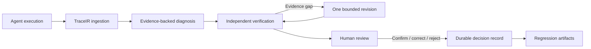

# SpanVouch

[](https://github.com/naturaljam/SpanVouch/actions/workflows/ci.yml)
[](https://www.python.org/)
[](LICENSE)

**Evidence-backed diagnosis, verification, and human review for tool-using agents.**

SpanVouch turns an agent execution trace into a reviewable engineering artifact. It finds
likely failures, binds every claim to trace evidence, verifies the diagnosis through an
independent path, permits at most one evidence-guided revision, and records the final human
decision in durable storage.

The default workflow is deterministic and fully offline. Model-backed diagnosis and
semantic verification are optional, explicit, and guarded against accidental paid calls.

## Why SpanVouch exists

Agent traces capture activity, but they are hard to trust. A plausible diagnosis can cite the
wrong tool call, overlook an invalid argument, or turn verifier disagreement into false
confidence. Logs alone do not provide a controlled path from failure to release decision.

SpanVouch closes that path:

- **Structured evidence:** strict TraceIR and versioned public contracts replace ad hoc log
  parsing.
- **Bounded diagnosis:** rules-first operation works offline; provider-backed diagnosis is
  opt-in.
- **Independent verification:** deterministic and isolated semantic verifiers re-check
  evidence instead of accepting diagnostic prose at face value.
- **Human authority:** automation can recommend, abstain, or request one revision; only a
  human can confirm, correct, or reject a case.
- **Durable recovery:** SQLite persistence, leases, idempotency keys, immutable events, and
  compare-and-swap updates keep interrupted reviews recoverable.
- **Regression evidence:** frozen datasets, canonical manifests, multi-framework labs, and
  byte-stable reports make behavior reproducible in continuous integration (CI).

## How the engineering loop works



The core dependency direction is deliberately narrow:

```text
contracts <- trace <- diagnosis <- verification <- review
```

FastAPI, SQLite, LangGraph, model providers, agent frameworks, and evaluation labs sit
behind adapters or at the delivery edge. Architecture tests prevent those dependencies
from leaking back into the core.

## What SpanVouch includes

SpanVouch connects diagnosis, review, evaluation, and delivery through tested boundaries.

| Area | What is included |
| --- | --- |
| Trace contracts | Strict Pydantic schemas, canonical JSON, SHA-256 identities, and frozen valid fixtures |
| Diagnosis | Deterministic rules engine plus an explicitly authorized DeepSeek adapter |
| Verification | Deterministic checks, optional semantic verification, abstention, and one-revision limit |
| Review | FastAPI and command-line interface (CLI) workflows for create, inspect, resume, confirm, correct, and reject |
| Recovery | SQLite persistence, process-safe leases, idempotent commands, immutable event order, and CAS updates |
| Evaluation | SupportLab and OpsLab, LangGraph and AutoGen adapters, frozen corpora, controlled matrices, and reproducible reports |
| Delivery | Locked dependencies, wheel builds, non-root Docker image, Compose health checks, and persistent data volume |
| Safety | Secret-minimized trace views, offline defaults, live-call opt-in, budget ledgers, and provenance-bound artifacts |

## Try SpanVouch offline

### Requirements

- Python 3.12
- [uv](https://docs.astral.sh/uv/) 0.8.x
- Docker with Compose v2 for the container path

Install the locked development environment:

```bash
git clone https://github.com/naturaljam/SpanVouch.git
cd SpanVouch
uv sync --frozen --group dev
```

Generate the frozen sample dataset and run both offline evaluators:

```bash
uv run spanvouch dataset generate \
  --output .cache/readme-check \
  --seed 20260715

uv run spanvouch evaluate diagnosis \
  --output .cache/rules.json

uv run spanvouch evaluate review \
  --output .cache/review-rules.json
```

These commands need no provider key and make no network request.

## Run the review service

Start the API locally:

```bash
uv run uvicorn spanvouch.api.app:app --host 127.0.0.1 --port 8000
```

The application programming interface (API) exposes these endpoints:

| Method | Endpoint | Purpose |
| --- | --- | --- |
| `GET` | `/health` | Service health |
| `POST` | `/v1/traces` | Ingest a TraceIR document |
| `POST` | `/v1/traces/{trace_id}/diagnoses` | Diagnose an ingested trace |
| `POST` | `/v1/traces/{trace_id}/diagnosis-reviews` | Create and execute a review case |
| `GET` | `/v1/diagnosis-reviews/{case_id}` | Read the complete case timeline |
| `POST` | `/v1/diagnosis-reviews/{case_id}/resume` | Resume recoverable work |
| `POST` | `/v1/diagnosis-reviews/{case_id}/decisions` | Record the human decision |

OpenAPI documentation is available at [http://127.0.0.1:8000/docs](http://127.0.0.1:8000/docs).

To diagnose a trace without creating a review case, call `POST /v1/traces/{trace_id}/diagnoses`.

### Review a frozen trace end to end

The repository includes a frozen SupportLab trace at
`evals/datasets/supportlab-v1/traces.jsonl`. Extract its first record and send it to
`POST /v1/traces`:

```bash
mkdir -p .cache
python -c 'from pathlib import Path; source=Path("evals/datasets/supportlab-v1/traces.jsonl"); Path(".cache/spanvouch-demo-trace.json").write_text(source.read_text(encoding="utf-8").splitlines()[0] + "\n", encoding="utf-8")'

trace_id="$(
  curl --fail --silent --show-error \
    -H 'content-type: application/json' \
    --data-binary @.cache/spanvouch-demo-trace.json \
    http://127.0.0.1:8000/v1/traces \
  | python -c 'import json,sys; print(json.load(sys.stdin)["trace_id"])'
)"

created="$(uv run spanvouch review create \
  --trace-id "$trace_id" \
  --diagnoser rules \
  --verifier deterministic \
  --idempotency-key demo-create-001)"
```

The create response contains the case identifier and optimistic-lock version. Use both to
inspect and confirm the diagnosis:

```bash
case_id="$(python -c \
  'import json,sys; print(json.loads(sys.argv[1])["case"]["case_id"])' \
  "$created")"
version="$(python -c \
  'import json,sys; print(json.loads(sys.argv[1])["case"]["version"])' \
  "$created")"

uv run spanvouch review show --case-id "$case_id"

uv run spanvouch review decide \
  --case-id "$case_id" \
  --action confirm \
  --expected-version "$version" \
  --reviewer-label local-reviewer \
  --idempotency-key demo-decision-001
```

The CLI is an HTTP client for the same review workflow:

```bash
uv run spanvouch review create \
  --trace-id trace_id \
  --diagnoser rules \
  --verifier deterministic \
  --idempotency-key demo-create-001

uv run spanvouch review show --case-id case_id

uv run spanvouch review decide \
  --case-id case_id \
  --action confirm \
  --expected-version version \
  --reviewer-label local-reviewer \
  --idempotency-key demo-decision-001
```

Review state defaults to `.data/spanvouch.db`. Set `SPANVOUCH_DB_PATH` to use another
SQLite location.

## Docker

Run the API as a non-root container with persistent review storage:

```bash
docker compose up --build --detach --wait api
curl --fail http://127.0.0.1:8000/health
docker compose down
```

`docker compose down` preserves the `spanvouch_data` volume. Add `--volumes` only when you
intend to delete stored review data. The optional Phoenix service is available through the
`phoenix` Compose service for local observability work.

## Use optional model providers

Offline rules and deterministic verification are the defaults. To use DeepSeek diagnosis
or hybrid semantic verification:

1. start from `.env.example`;
2. set `DEEPSEEK_API_KEY` in the process environment, never a tracked file;
3. begin with an allowlisted smoke sample;
4. pass `--allow-live-api` explicitly.

Example:

```bash
uv run spanvouch evaluate diagnosis \
  --diagnoser deepseek \
  --allow-live-api \
  --run-id invalid_argument-01 \
  --output .cache/deepseek-smoke.json
```

Live calls can incur cost and are excluded from CI. Phase 5 experiment tooling adds frozen
provider identities, shared budget ledgers, GPU lease records, and separated label joins;
see the [reproduction runbook](docs/evaluation/phase5-reproduction-runbook.md) before using
those paths.

## Verify reproducibility and quality

The repository includes six versioned public contract roots, deterministic datasets,
manifest-bound evaluation artifacts, dependency-direction tests, and offline end-to-end
acceptance tests. CI enforces:

```bash
uv run ruff check src tests
uv run mypy
uv run pytest --cov=spanvouch --cov-fail-under=93
uv build --wheel --build-constraints build-constraints.txt --require-hashes --no-cache
docker compose config --quiet
```

CI also regenerates frozen datasets, compares deterministic reports byte for byte, builds
the image, runs it as UID/GID `10001:10001`, and verifies SQLite state across a container
restart. The detailed engineering evidence is recorded in the
[Phase 5 acceptance report](docs/evaluation/phase5-acceptance.md).

## Understand the security model

SpanVouch stores canonical diagnostic trace views, diagnosis revisions, verifier summaries,
events, and human decisions. It is designed not to persist prompts, authorization headers,
API keys, hidden reasoning, or raw provider responses.

The included service does not provide authentication or role-based access control (RBAC). `reviewer_label` is audit
text supplied by the caller, not an authenticated identity. Keep the default service bound
to localhost unless you add an authenticated gateway and deployment controls appropriate
for your environment. See [SECURITY.md](SECURITY.md) for vulnerability reporting.

## Explore the repository

The source tree separates core contracts from adapters, delivery layers, and evaluation.

```text
src/spanvouch/
  contracts/      Versioned public schemas and canonical serialization
  trace/          Trace projection and repositories
  diagnosis/      Rules and provider-backed diagnosis
  verification/   Deterministic and semantic verification
  review/         Workflow, persistence ports, revision, and decisions
  adapters/       SQLite, LangGraph, model, and framework integrations
  api/            FastAPI composition and routes
  cli/            Operator-facing commands
  evaluation/     Reproducible datasets, matrices, statistics, and artifacts
  labs/           Deterministic agent failure environments
tests/             Unit, contract, architecture, integration, and E2E tests
evals/             Frozen datasets, configs, schemas, and reference reports
docs/              Contracts, ADRs, runbooks, migrations, and technical background
```

## Read the technical background

IVAD, Independently Verified Agent Diagnosis, is the protocol behind SpanVouch's separation
of diagnosis, evidence verification, abstention, and human authority. The repository keeps
its protocol designs and evaluation records for auditability, but offline engineering
acceptance is not presented as evidence of improved model accuracy.

Start with the [contract catalog](docs/contracts/catalog.md),
[core/adapters ADR](docs/architecture/adr-003-core-adapter-boundaries.md), and
[Phase 3 review runbook](docs/evaluation/phase3-reproduction-runbook.md).

## Contributing

Issues and pull requests are welcome. Read [CONTRIBUTING.md](CONTRIBUTING.md) before changing
contracts, frozen artifacts, or provider boundaries.

## License

SpanVouch is available under the [MIT License](LICENSE).
