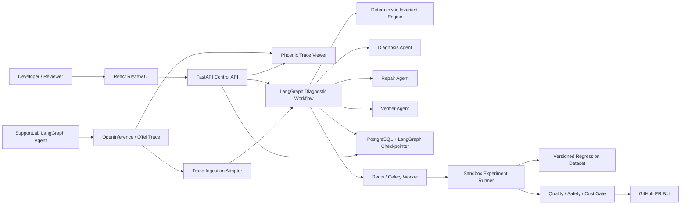
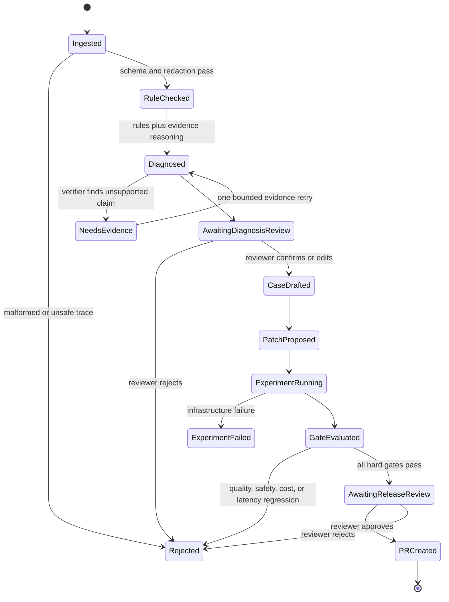

# Agent Failure Clinic 详细设计计划书

> 状态：已批准
> 日期：2026-07-15
> 项目周期：4–6 周
> 目标岗位：Agent/LLM 应用工程
> 主模型：DeepSeek OpenAI-compatible API

## 1. 项目摘要

Agent Failure Clinic（以下简称 AFC）是一个面向 Agent 开发者的“失败轨迹诊断到回归门禁”系统。它接收工具型 Agent 的结构化运行轨迹，先用确定性规则检查工具参数、执行顺序、权限和错误传播，再由 LLM 在证据约束下定位关键失败步骤。经人工确认后，系统把生产失败转换成可复现的回归样例，针对 Prompt、工具描述或结构化配置生成候选修复，在冻结数据集上重放基线与候选版本，最后以 CI 门禁和 GitHub Pull Request 的方式交付变更。

项目的核心价值不是展示“多个 Agent 会互相聊天”，而是证明一套 Agent 系统可以被观测、诊断、复现、评测和安全改进。最终形成如下闭环：

```text
真实失败 → 结构化轨迹 → 关键失败步与证据 → 人工确认
       → 最小回归样例 → 受限修复候选 → 批量重放
       → 质量/成本/安全门禁 → GitHub PR → 新版本继续观测
```

## 2. 背景与问题定义

传统服务故障通常能通过异常堆栈、指标和确定性日志定位。Agent 的失败则可能来自错误的工具选择、正确工具的错误参数、遗漏前置条件、忽略工具错误、上下文污染、循环耗尽或最终状态判断错误。最终回答不正确，并不等于最后一个 LLM 调用是根因；真正的关键失败可能发生在更早的决策步骤。

现有 tracing 平台擅长展示 span、成本和延迟，但“哪一步造成失败、为什么、如何把这次失败沉淀为测试、修改后是否真的改善”仍需要开发者手工完成。AFC 聚焦这个缺口，不重建通用 tracing 后端，而是在 OpenTelemetry/OpenInference 风格轨迹之上提供诊断与持续评测应用层。

## 3. 目标用户与使用场景

### 3.1 目标用户

- 正在开发工具调用型 Agent 的个人开发者或小型 AI 应用团队；
- 已经拥有 trace，但缺少系统化失败分析和回归流程的团队；
- 需要比较 Prompt、工具描述、模型或参数版本，并把质量门禁接入 CI 的工程师。

### 3.2 核心用户故事

1. 开发者导入一次失败运行，查看系统定位的关键失败步骤、失败类别、证据引用和替代假设。
2. 开发者确认或修正诊断，系统将该轨迹转成最小、脱敏、可重复执行的回归样例。
3. 系统为允许修改的 Prompt、工具描述或 JSON/YAML 配置生成候选 diff。
4. 开发者启动实验，在同一冻结数据集、固定模型设置和随机种子策略下比较基线与候选版本。
5. 只有质量、安全、成本和延迟门禁全部通过，系统才创建 GitHub PR；系统永不自动合并。
6. 服务或 worker 重启后，等待人工审批或正在执行的实验能够从持久化状态恢复。

## 4. 成功标准

### 4.1 产品验收标准

- 能从一次失败轨迹完成“诊断—确认—回归样例—候选修复—实验—门禁—PR”端到端演示；
- 每条诊断都引用具体 span、工具调用或规则结果，不能只输出泛化解释；
- 人工可以批准、修正或拒绝诊断与修复，所有决定进入审计记录；
- 所有会修改数据集、代码分支或沙箱业务状态的动作均具备幂等键；
- Docker Compose 可一键启动 API、worker、数据库、队列、前端和观测组件；
- 公共演示环境不暴露 DeepSeek、GitHub 或数据库凭据。

### 4.2 评测验收目标

在冻结的 100 条轨迹测试集上进行三次独立评测，测试集包含 80 条失败轨迹和 20 条正确轨迹：

| 指标 | 验收目标 |
|---|---:|
| 失败类型分类 Macro-F1 | ≥ 0.75 |
| 关键失败 span Top-1 准确率 | ≥ 0.70 |
| 关键失败 span Top-3 召回率 | ≥ 0.90 |
| 证据引用精确率 | ≥ 0.90 |
| 回归样例复现原失败的比例 | ≥ 0.85 |
| 正确轨迹误报率 | ≤ 0.10 |
| 已知高风险违规的门禁拦截率 | 100% |
| 注入 worker 中断后的任务恢复率 | ≥ 0.95 |
| 单条诊断总 token 硬上限 | 20,000 |

这些数字是项目验收阈值，不是尚未取得的项目成果；最终简历只使用真实评测结果。

## 5. 范围与非目标

### 5.1 首版范围

- 一个被测 Agent：基于 LangGraph 的沙箱订单支持 Agent；
- 一个轨迹标准：OpenTelemetry/OpenInference 风格的 Agent、LLM、tool span；
- 八类失败 taxonomy；
- 一套确定性 invariant 规则引擎；
- 三个权限不同的 LLM 角色：诊断、修复、验证；
- 人工确认与可恢复执行；
- 轨迹级回归数据集、版本实验和 CI 门禁；
- Prompt、工具描述和 JSON/YAML 配置级候选修复；
- GitHub PR 创建，不自动合并；
- 本地 Docker Compose 与单机 Linux VPS 部署。

### 5.2 明确不做

- 不做 Langfuse、Phoenix 或 LangSmith 的替代品；
- 不在首版支持多个 Agent 框架或任意 trace 格式；
- 不自动修改任意 Python/TypeScript 业务代码；
- 不训练或微调模型；
- 不做完整 OAuth/身份供应商；
- 不做 Kubernetes、多租户计费或企业级 RBAC；
- 不承诺自动修复所有 Agent 故障；
- 不使用 LLM-as-Judge 作为唯一真值。

当周期需要压缩至 4 周时，优先保留诊断、人工确认、回归生成和实验门禁；GitHub PR Bot 与公共云部署可放在第 5 周完成，但本地 Docker Compose 仍是必交付项。

## 6. 被测环境：SupportLab Agent

为了让 AFC 有稳定、可复现的真实工具轨迹，仓库内提供一个小型订单支持 Agent 作为测试夹具。它不是最终产品卖点，只用于产生有业务约束、有副作用、有明确真值的运行数据。

SupportLab Agent 具备以下沙箱工具：

- `get_customer(customer_id)`：读取客户信息；
- `get_order(order_id)`：读取订单与状态；
- `get_refund_policy(order_id)`：读取退款规则；
- `calculate_refund(order_id, items)`：计算可退款金额；
- `submit_refund(order_id, amount, reason)`：写入沙箱数据库，属于高风险动作；
- `handoff_to_human(reason)`：生成转人工记录。

退款提交必须满足“客户与订单匹配、订单状态允许、政策检查已完成、金额不超过计算结果、人工批准”五项前置条件。由此可以构造工具选错、参数错误、漏步骤、权限违规和忽略工具错误等轨迹真值。

## 7. 失败分类体系

首版固定八类，避免分类空间在开发过程中不断膨胀：

1. `WRONG_TOOL`：选择了错误工具；
2. `INVALID_ARGUMENT`：工具正确但参数错误、缺失或越权；
3. `MISSING_PRECONDITION`：未完成必需前置步骤；
4. `IGNORED_TOOL_ERROR`：工具失败后仍按成功路径继续；
5. `CONTEXT_CORRUPTION`：使用过期、矛盾或被注入污染的信息；
6. `POLICY_VIOLATION`：违反业务规则、审批或权限边界；
7. `LOOP_OR_BUDGET_EXHAUSTION`：重复调用、超过步数、时间或 token 预算；
8. `INVALID_FINAL_STATE`：中间步骤基本正确，但最终状态或结构化输出错误。

正确轨迹使用 `NO_FAILURE` 标签。每条失败数据包含一个主要失败类型、关键 span 真值、可选的次要错误和简短人工解释。

## 8. 总体架构



### 8.1 组件职责

| 组件 | 单一职责 | 主要依赖 |
|---|---|---|
| SupportLab Agent | 产生有真值的工具执行轨迹和沙箱副作用 | LangGraph、PostgreSQL |
| Trace Ingestion Adapter | 校验、脱敏并转换 OpenInference/OTel span 为内部 IR | Pydantic、OTel schema |
| Invariant Engine | 执行确定性的顺序、参数、权限、错误传播和预算检查 | 规则配置、Trace IR |
| Diagnostic Workflow | 控制节点、状态、重试、审批、恢复和循环上限 | LangGraph、PostgreSQL checkpointer |
| Diagnosis Agent | 在规则结果和轨迹证据上提出根因、关键 span 与替代假设 | DeepSeek API，只读工具 |
| Repair Agent | 生成回归样例草案和允许范围内的修复 diff | DeepSeek API、临时 Git 分支 |
| Verifier Agent | 在隔离上下文中检查证据覆盖、修复意图和实验异常 | DeepSeek API，只读结果 |
| Experiment Runner | 在沙箱中对基线和候选版本批量重放冻结数据集 | Celery、Docker、数据集快照 |
| Release Gate | 用确定性阈值决定通过、拒绝或要求人工复核 | 实验指标、策略配置 |
| Review UI | 展示轨迹、证据、诊断、diff、实验和审批 | React、FastAPI |
| Phoenix | 展示原始 trace 和 span 树，不承载 AFC 业务状态 | OpenTelemetry/OpenInference |
| GitHub PR Bot | 将通过门禁的 allowlist 文件 diff 提交至新分支并创建 PR | GitHub App/细粒度 Token |

## 9. Agent 协作设计

多 Agent 仅用于权限隔离和独立验证，不使用自由群聊。

### 9.1 Diagnosis Agent

- 权限：只读 Trace IR、规则结果和版本元数据；
- 输入：单次运行轨迹、预期业务结果、invariant violations；
- 输出：严格结构化 `DiagnosisReport`；
- 约束：必须引用 span ID；最多给出一个主根因和两个替代假设；不得提出代码修改。

### 9.2 Repair Agent

- 权限：可在临时沙箱分支修改 allowlist 中的 Prompt、工具描述、JSON/YAML 配置和回归样例；
- 输入：经人工确认的诊断、原失败轨迹和现有测试；
- 输出：`RegressionCase` 与至多三个 `PatchCandidate`；
- 约束：不能访问生产凭据，不能修改执行器、安全门禁或评测阈值。

### 9.3 Verifier Agent

- 权限：只读诊断、候选 diff 与实验结果；
- 输入中不包含 Repair Agent 的隐藏推理，仅包含结构化产物；
- 输出：证据一致性、潜在过拟合、未覆盖风险和建议结论；
- 约束：它不能直接决定发布，只为确定性 Release Gate 和人工审批提供补充信号。

### 9.4 确定性协调器

LangGraph 状态机掌管所有重试、超时、预算、循环和审批。任一 LLM 节点最多重试两次；Diagnosis 与 Verifier 之间最多一次补证循环；Repair Agent 最多产生三个候选；工作流总步数有硬上限。LLM 无权改变这些限制。

## 10. 主工作流与状态转换



等待审批时保存完整状态和版本指纹。恢复时若模型配置、Prompt、工具 schema 或代码版本发生变化，原审批失效并要求重新确认，避免在不同定义上继续旧任务。

## 11. 核心数据模型

### 11.1 TraceIR

- `trace_id`、`run_id`、`source`、`schema_version`；
- span 的 `span_id`、`parent_id`、`kind`、开始/结束时间和状态；
- Agent/LLM/tool/retrieval/approval 事件；
- 脱敏后的输入、输出、工具参数、工具结果和错误；
- token、延迟、模型、Prompt 版本、工具 schema 版本；
- 预期业务结果、实际业务结果和数据集标签。

### 11.2 InvariantResult

- 规则 ID、规则版本、pass/fail；
- 关联 span ID 与结构化证据；
- 严重级别、是否属于硬门禁；
- 确定性解释，不由 LLM 改写真值。

### 11.3 DiagnosisReport

- 主失败类型、关键 span ID 列表；
- `cause → propagation → outcome` 因果链；
- 每条结论对应的证据引用；
- 最多两个替代假设及排除证据；
- 置信度与推荐修复表面；
- 使用的模型、Prompt、规则和 schema 版本。

### 11.4 RegressionCase

- 来源 trace 和人工确认记录；
- 最小输入 fixture 与 mock 工具响应；
- 预期工具集合、参数约束、允许的轨迹变体；
- 确定性 oracle、人工标签和可选 LLM evaluator；
- 隐私检查结果、数据集版本和内容哈希。

### 11.5 ExperimentRun

- 冻结数据集哈希；
- baseline/candidate 的 Git SHA、Prompt 和工具 schema 版本；
- 模型设置、并发、超时、重试和随机性策略；
- 每条样例结果、聚合指标、成本和延迟；
- 门禁结果与失败原因。

## 12. 规则与证据系统

规则引擎先于 LLM 执行，首版包含：

- 工具名和参数 schema 校验；
- 必需步骤的先后与依赖关系；
- 高风险工具审批存在性；
- 订单、客户和金额的一致性；
- 工具错误是否被正确处理；
- 重复调用、最大步数、超时和 token 预算；
- 最终结构化输出与沙箱业务状态是否一致；
- Prompt/tool 输出中的间接注入标记是否进入高风险参数。

证据引用采用 span ID 和字段路径，例如 `span_17.tool.arguments.amount`，前端可以直接跳转到对应轨迹节点。诊断文本中不存在的 span 或字段会被 schema validator 拒绝。

## 13. 回归样例与修复策略

### 13.1 最小回归样例

系统从原始轨迹删除与失败无关的上下文，在保持失败可复现的前提下逐步缩减消息和工具结果。缩减后的样例必须再次触发同一确定性规则或同一人工确认失败，才能进入数据集。

### 13.2 允许的修复表面

- 系统 Prompt 的局部条款；
- 工具名称、描述、参数说明和示例；
- 路由与最大步数等 JSON/YAML 配置；
- 明确的输入校验规则；
- 回归数据集本身。

安全门禁、评测阈值、凭据处理、审批逻辑和任意业务代码不允许由 Repair Agent 修改。候选 diff 必须先通过语法/schema 校验，再进入实验。

## 14. 评测设计

### 14.1 数据集构建

- 20 条正确控制轨迹；
- 八类失败各 10 条，共 80 条失败轨迹；
- 至少 60% 由确定性 fault injection 产生；
- 至少 20% 来自 Prompt、工具描述或模型版本变化产生的自然失败；
- 剩余样例用于组合故障和边界条件；
- 所有样例由人工确认主标签和关键 span；
- 数据集按内容哈希冻结，测试集不进入修复 Agent 上下文。

### 14.2 基线

1. 只使用最终回答进行单次 LLM 分类；
2. 给 LLM 完整 trace，但不提供 invariant 结果；
3. 只使用确定性规则，不使用 LLM；
4. AFC 完整方案：规则 + 证据约束诊断 + 人工确认 + 回归门禁。

### 14.3 指标层次

- 组件层：规则准确率、结构化输出成功率、证据引用精度；
- 诊断层：失败分类、关键 span 定位、因果链覆盖；
- 回归层：失败复现率、测试稳定性、数据泄漏检查；
- 系统层：任务恢复、幂等、p50/p95 延迟、token 和 API 成本；
- 发布层：任务成功率变化、安全违规、成本/延迟回归、旧能力退化；
- 消融层：去掉规则、Verifier 或人工确认后的质量和成本变化。

LLM evaluator 只用于补充语义评分。能用数据库状态、工具参数、轨迹约束和人工标签判断的项目，全部优先采用确定性真值。

## 15. Release Gate

候选版本只有同时满足以下条件，才能进入人工发布复核：

- 新增回归样例全部通过；
- 冻结数据集整体任务成功率不下降；
- 任何高风险动作误放行数量为零；
- 失败分类或关键 span 指标没有超过预设容忍度的退化；
- p95 延迟和平均 token 使用不超过基线的 20%；
- 所有修改文件均位于 allowlist；
- Verifier 未发现无证据结论或明显针对单一样例的过拟合；
- 实验数据集哈希、Git SHA 和模型配置完整可追溯。

Gate 只产生 `PASS`、`FAIL` 或 `REVIEW_REQUIRED`。任何指标缺失、worker 部分失败或版本不一致都不能按通过处理。

## 16. 错误处理与可靠性

| 失败场景 | 处理策略 |
|---|---|
| malformed trace、孤儿 span、时间倒序 | 拒绝导入并返回字段级错误，不调用 LLM |
| trace 含密钥或敏感字段 | allowlist 脱敏并执行 secrets scan；失败则隔离 |
| DeepSeek 超时、429、5xx | 指数退避、最多两次重试、记录失败；可降级为 rule-only 报告 |
| LLM 输出不满足 schema | 本地校验并进行一次结构化修复调用，仍失败则人工处理 |
| worker 中断 | 从 PostgreSQL checkpoint 和幂等任务 ID 恢复 |
| 实验只完成部分样例 | 标记 `PARTIAL`，Release Gate 必须失败 |
| 人工长期未审批 | 保持挂起并显示版本指纹；不自动放行 |
| GitHub API 失败 | 保留通过门禁的不可变 artifact，可安全重试创建 PR |
| 候选导致沙箱副作用 | 每个 case 使用独立事务或数据库快照，执行后回滚 |
| Prompt injection 出现在工具结果中 | 标为不可信数据；禁止其改变系统规则、工具权限和修复范围 |

## 17. 安全与隐私边界

- 原始 trace 在发送给 DeepSeek 前经过字段 allowlist、PII 清洗和 secrets scanner；
- API 密钥仅存在服务端环境变量或 secret store，不写入 trace、数据库业务字段和前端；
- Diagnosis 与 Verifier 只有只读工具；Repair Agent 只能操作临时分支和 allowlist 文件；
- `submit_refund`、数据集写入、候选分支推送和 PR 创建均需明确权限与审计；
- GitHub 凭据采用最小仓库权限，禁止 push 到默认分支；
- 公共 Demo 使用独立沙箱数据库，不连接真实业务系统；
- 所有模型调用记录输入哈希、输出哈希、模型与 Prompt 版本，但敏感正文不进入普通应用日志；
- 数据保留策略：原始 Demo trace 默认保存 30 天，脱敏回归样例按版本长期保存，用户可手工删除。

## 18. 技术选型

| 层 | 选择 | 理由 |
|---|---|---|
| 语言 | Python 3.12 | Agent、评测与数据工具生态成熟 |
| API | FastAPI + Pydantic | 明确 schema、异步接口、自动 OpenAPI |
| Agent 编排 | LangGraph | 显式状态图、checkpoint、interrupt 和恢复 |
| 模型接入 | DeepSeek OpenAI-compatible API，封装 provider interface | 满足现有资源，并保留更换模型能力 |
| 后台任务 | Celery + Redis | 批量实验、并发、重试和状态分离 |
| 持久化 | PostgreSQL + JSONB | 工作流状态、数据集元数据和审计统一持久化 |
| Trace 语义 | OpenTelemetry + OpenInference | 避免绑定单一 Agent 框架或观测平台 |
| Trace UI | Phoenix OSS | 复用 span 查看能力，不自建通用观测前端 |
| 前端 | React + TypeScript + Vite | 提供轻量但可交付的审阅与实验界面 |
| 测试 | pytest、testcontainers、Playwright | 覆盖组件、真实依赖和端到端流程 |
| 部署 | Docker Compose + Caddy | 单机可复现部署、TLS 与反向代理简单可控 |
| CI/CD | GitHub Actions + GHCR | 测试、评测门禁、镜像构建与部署证据 |

## 19. 前端最小信息架构

首版只有四个主页面，避免把周期耗在 Dashboard：

1. **Runs**：轨迹列表、状态、失败类型、成本和延迟；
2. **Diagnosis Review**：span 树链接、规则违规、证据、替代假设和确认/修改/拒绝；
3. **Regression & Patch**：最小回归样例、候选 diff 和允许修改范围；
4. **Experiments**：基线/候选指标、逐样例变化、门禁结论和创建 PR 操作。

原始 trace 树直接链接到 Phoenix；AFC 前端只展示诊断与改进闭环相关信息。

## 20. 代码模块边界

计划中的仓库模块如下，具体文件拆分在实施计划中确定：

```text
apps/
  api/                 # FastAPI control plane
  web/                 # React review UI
  worker/              # Celery experiment workers
packages/
  trace_ir/            # canonical schema and adapter
  invariants/          # deterministic rule engine
  workflows/           # LangGraph states and nodes
  agents/              # diagnosis, repair, verifier interfaces
  regression/          # case minimization and dataset versioning
  experiments/         # replay runner, metrics and baselines
  release_gate/        # deterministic policies
  integrations/        # DeepSeek, Phoenix and GitHub adapters
fixtures/
  supportlab/           # sandbox target agent and fault injection
evals/
  datasets/            # versioned manifests, not raw secrets
  reports/             # generated evaluation artifacts
infra/
  compose/              # local and VPS deployment
docs/
  architecture/         # ADRs and diagrams
```

模块之间通过 Pydantic schema 和协议接口通信。领域对象不直接依赖 FastAPI、Celery、Phoenix 或 GitHub SDK，便于单元测试和替换基础设施。

## 21. 6 周里程碑

### 第 1 周：真值环境与可观测基线

- 建立仓库、CI、Docker Compose 和配置管理；
- 完成 SupportLab Agent、沙箱工具和确定性业务 oracle；
- 接入 OpenInference/OTel trace 与 Phoenix；
- 定义 TraceIR、八类 taxonomy 和 20 条初始轨迹；
- 建立“最终回答单次分类”与“规则 only”基线。

验收：可运行被测 Agent、查看完整 trace，并能用脚本重放初始数据集。

### 第 2 周：轨迹导入与规则诊断

- 完成 ingestion、schema 校验、脱敏和 secrets scan；
- 实现 invariant engine 与证据字段路径；
- 完成工作流持久化、幂等、超时和重试；
- 建立 Runs 与基础诊断页面；
- 将数据集扩展至 40 条轨迹。

验收：无 LLM 情况下能识别确定性违规，异常输入不会进入模型调用。

### 第 3 周：证据约束诊断与人工确认

- 完成 Diagnosis Agent、结构化输出和 span 引用校验；
- 完成 Verifier 的独立证据审查与一次补证循环；
- 完成 Diagnosis Review 页面和可恢复审批；
- 注入 API 超时、worker 重启和 schema 错误；
- 评测关键 span 与失败分类，数据集达到 60 条。

验收：服务重启后审批可恢复；诊断指标达到可继续迭代的中期门槛。

### 第 4 周：回归生成与版本实验

- 完成 RegressionCase schema、最小化与数据集版本化；
- 完成 Repair Agent 的 allowlist diff；
- 完成 baseline/candidate 沙箱重放、指标聚合和成本记录；
- 完成 Experiments 页面与确定性 Release Gate；
- 数据集达到 80 条，并加入正确控制轨迹。

验收：一次真实失败可转换成稳定回归样例，并比较至少两个版本。

### 第 5 周：PR 闭环、安全和生产部署

- 完成 GitHub PR Bot、分支隔离和 PR 证据摘要；
- 完成高风险动作审批、审计与攻击测试；
- 完成 Caddy、生产 Compose、备份和健康检查；
- 建立 GitHub Actions 评测门禁与镜像发布；
- 在 Linux VPS 部署公共 Demo。

验收：通过门禁的候选可创建 PR；失败候选和不完整实验无法绕过门禁。

### 第 6 周：冻结评测与作品集交付

- 冻结 100 条轨迹数据集并完成三次独立评测；
- 完成基线、消融、成本、延迟、恢复和安全报告；
- 修复高优先级失败案例，稳定一键启动；
- 完成 README、架构图、数据集卡、评测报告和演示视频；
- 根据真实结果撰写中英文简历 bullet 和面试讲解材料。

验收：新用户仅按 README 可启动系统并复现核心评测；所有简历指标可回溯到报告 artifact。

## 22. 测试策略

- **单元测试**：TraceIR 校验、规则、门禁、数据集哈希、脱敏和指标；
- **契约测试**：DeepSeek、Phoenix 和 GitHub adapter 的请求/响应 schema；
- **集成测试**：PostgreSQL checkpointer、Redis/Celery、沙箱数据库和 Git 分支；
- **黄金测试**：人工标注轨迹对应固定关键 span 与 failure type；
- **故障注入**：工具超时、返回脏数据、worker kill、重复消息、网络 429；
- **安全测试**：间接 prompt injection、恶意工具描述、越权参数、秘密泄漏和 PR 路径逃逸；
- **端到端测试**：从导入失败到生成 PR 的主流程，以及拒绝、恢复和门禁失败路径；
- **负载测试**：并发导入和批量重放，关注队列积压、p95 和 API 限流。

## 23. 主要风险与缓解

| 风险 | 影响 | 缓解措施 |
|---|---|---|
| 与 AgentRx/Langfuse 能力重叠 | 项目差异不清 | 不做通用观测或只做诊断；突出可运行回归 artifact、版本门禁和 PR 闭环 |
| 数据集过度合成 | 指标缺乏说服力 | 加入自然版本退化轨迹、正确控制组、人工标签和公开数据集格式对照 |
| 同一模型既生成又验证 | 自我偏置 | 确定性规则与人工标签为主真值；Verifier 隔离上下文；报告该限制 |
| 自动修复范围失控 | 周期爆炸和安全风险 | 仅允许 Prompt、工具描述、配置和测试；禁止任意代码修改 |
| 前端和观测平台占用过多时间 | 核心诊断延期 | 复用 Phoenix，AFC 前端只做四页；第 4 周未完成核心闭环则冻结 UI 功能 |
| DeepSeek 结构化输出波动 | 工作流不稳定 | schema 验证、一次修复重试、失败转人工、provider abstraction |
| API 成本或限流 | 无法批量评测 | token 硬预算、缓存、并发限制、小样本 dry-run 后再全量运行 |
| 公共 Demo 被滥用 | 费用和安全问题 | 登录、速率限制、每日预算、沙箱数据、禁用任意用户自定义工具 |

## 24. 部署与运维

### 24.1 本地

`docker compose up` 启动 web、api、worker、postgres、redis、phoenix 和 caddy。Demo 数据与测试密钥由 seed 脚本创建。开发模式可以使用 mock model，避免每次测试消耗 API。

### 24.2 公共环境

- 单台 Linux VPS 部署 Docker Compose，不在首版引入 Kubernetes；
- Caddy 自动 TLS，API、Web 和 Phoenix 分路径代理；
- GitHub Actions 构建镜像并推送 GHCR，生产机只拉取固定 digest；
- PostgreSQL 每日备份，实验 artifact 存对象存储或加密卷；
- health/readiness、队列长度、失败任务、API token 和 p95 延迟进入监控；
- 部署失败时回退到上一镜像 digest，数据库迁移必须具备向后兼容窗口。

## 25. 最终交付物

1. 可公开阅读的 GitHub 仓库；
2. 本地 Docker Compose 与公共 Demo；
3. 架构图、状态图和关键 ADR；
4. 100 条脱敏轨迹的数据集卡与生成说明；
5. 基线、消融、成本、延迟、可靠性和安全评测报告；
6. 至少三个完整失败案例：诊断正确、诊断错误后人工纠正、候选修复被门禁拒绝；
7. CI 评测门禁与示例 GitHub PR；
8. 3–5 分钟演示视频；
9. 中英文简历 bullet 与 10 分钟面试讲解提纲。

## 26. 简历证据设计

最终简历不预写虚假提升数字，而按真实结果填入以下结构：

> **Agent 可靠性闭环**——面向工具调用 Agent 构建生产轨迹诊断系统，将 OpenInference/OTel span 归一化为可审计 IR，结合确定性 invariants 与证据约束 LLM 定位关键失败步骤，并将人工确认失败自动转为回归样例和 CI 质量门禁。

> **可恢复多 Agent 工程**——基于 LangGraph 编排诊断、受限修复与独立验证角色，以 PostgreSQL checkpoint 实现审批和实验任务的中断恢复；通过幂等、重试预算、沙箱、allowlist diff 和人工发布门禁约束高风险动作。

> **评测与生产交付**——构建包含八类故障的冻结轨迹集，对比 final-only、rule-only 与完整方案，报告关键 span 定位、Macro-F1、回归复现率、p95 延迟与单任务成本；以 Docker Compose、GitHub Actions 和公共 Demo 完成交付。

只有评测报告中实际通过的数据才会替换为量化数字。

## 27. 决策记录

- 选择“轨迹诊断到回归门禁”，不选择通用 AI-SRE、通用 observability 或普通多 Agent 应用；
- 使用 LangGraph 控制生命周期，LLM 只承担语义诊断、受限修复和独立验证；
- 使用 OpenTelemetry/OpenInference 作为轨迹语义，使用 Phoenix 展示原始 trace；
- 使用 DeepSeek API，同时保留 provider abstraction；
- 首版只支持一个被测 Agent、一个轨迹入口和配置级修复；
- 所有发布动作由确定性 Gate 与人工共同决定，系统不自动合并 PR。

## 28. 参考研究

- 项目机会调研：`docs/research/agent-project-landscape.md`
- [LangGraph reference](https://langchain-ai.github.io/langgraph/reference/)
- [OpenAI Agents SDK tracing](https://openai.github.io/openai-agents-python/tracing/)
- [Langfuse 2026 roadmap](https://langfuse.com/docs/roadmap)
- [LangSmith Agent evaluation](https://docs.langchain.com/langsmith/evaluation-approaches)
- [OpenInference specification](https://arize-ai.github.io/openinference/spec/)
- [Microsoft AgentRx](https://github.com/microsoft/AgentRx)
- [MCP security best practices](https://modelcontextprotocol.io/docs/tutorials/security/security_best_practices)
